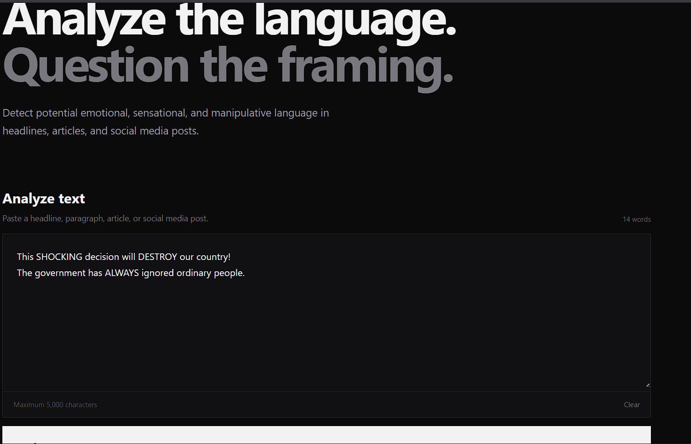
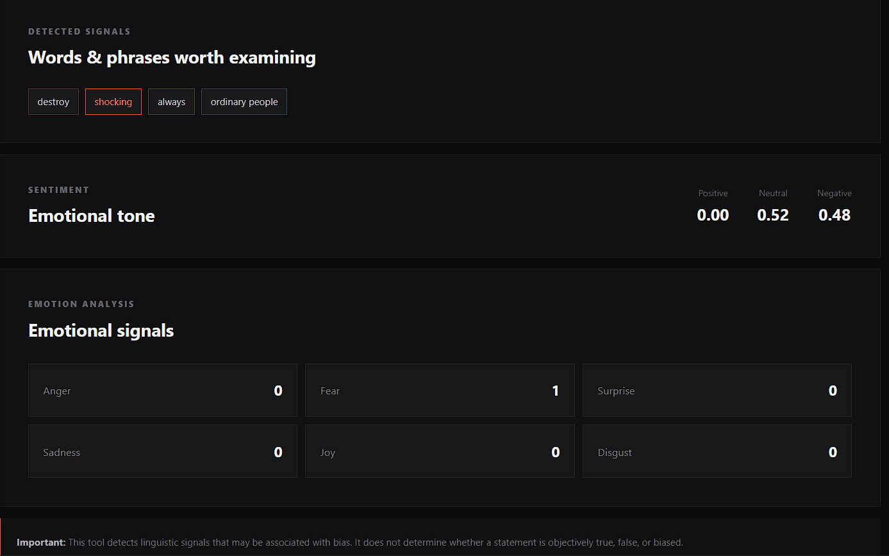
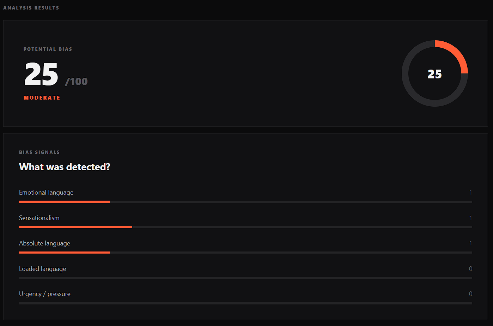

# BIAS DETECTER- "Are you being manupulated?"

## click here to try yourself- https://bias-detector.naitik.hackclub.app/

Ive build a webpage where someone pasted a news headline or paragraph, and my logic detects things like - 
-Emotional and loaded words
-Sensational language
-Absolute statements
-Urgency/manipulative phrases
-Sentiment using VADER
-Emotions using NRC
-Capitalization and punctuation patterns

It then combines these signals into a Potential Bias Score. The score is only an indicator  it doesn't decide whether something is objectively biased or true.

# HOW DOES IT WORKS BRO?
- Paste a headline, paragraph, article, or social media post.



-click analyze text and wait for some seconds .



-boom you have the analysis , clean simple



# TECH STACK

Python
Flask
NLTK
VADER Sentiment
NRClex
HTML
CSS
JavaScript

## data/NLP
re - text cleaning
collections-word frequency

## Running Locally

Clone the repository and install the required libraries:
```bash
pip install -r requirements.txt
```

Then start the app:

python app.py

Open http://127.0.0.1:5000 in your browser.

# AI usage

I used AI to get help with the CSS file, and I used GitHub Copilot to check my code for errors and debugging.

nlp logic and rest file are made by me(I used docs and yt tutorial for learning any part)
